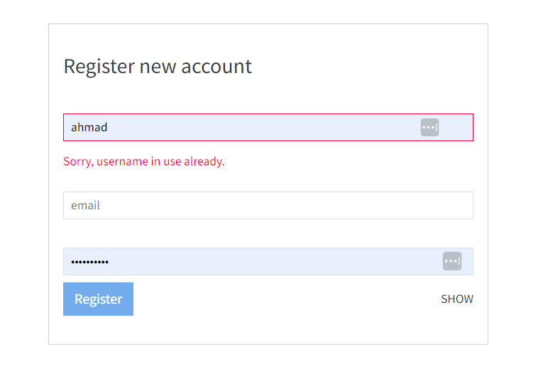

# ExpenseFlow-Django
<head>
    Django Expense Monitoring Website
</head>

<body>
    <h1>A Django Website for Monitoring and Analyzing Expenses</h1>
    
Using PostgresDB

    <h2>Registration:</h2>
    
Form validation for username, email, password

    
Email confirmation message to activate account

    <h2>Login:</h2>
    
Can't enter the main page if not logged in

    <h2>Expenses:</h2>
    
Expenses can be added, edited with input validation, and deleted

    
Working on more functionality

    
<strong>Before using, make sure to:</strong>

    <ul>
        <li>Create a file for environment variables, or</li>
        <li>Add the following variables to the settings.py file:</li>
    </ul>
    
DB_NAME, DB_USER, DB_USER_PASSWORD, DB_HOST, SECRET_KEY, EMAIL_HOST, EMAIL_HOST_USER, EMAIL_USE_TLS,
        DEFAULT_FROM_EMAIL, EMAIL_PORT, EMAIL_HOST_PASSWORD

</body>

  
  
  
  
  
  

